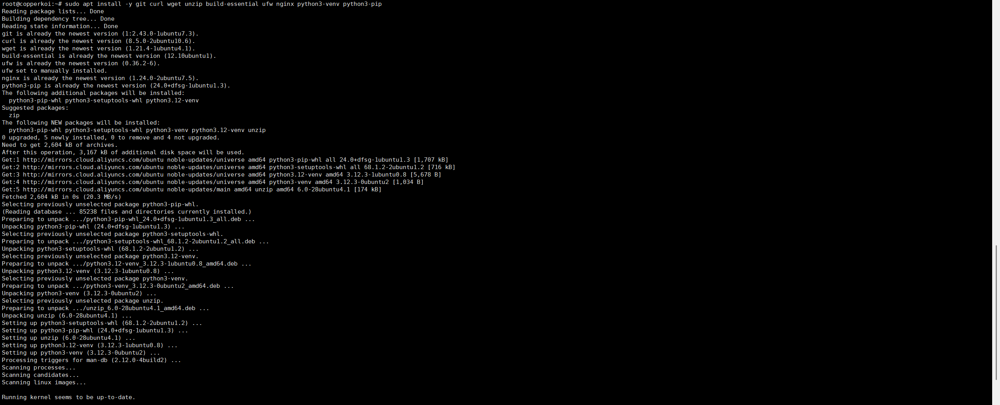

# MyService

安装常用工具和Nginx

```bash
apt install -y git curl wget unzip build-essential ufw nginx python3-venv python3-pip
```



然后创建项目目录，激活nenv，下一些工具和依赖

```bash
mkdir -p ~/projects/blog-backend
cd ~/projects/blog-backend
python3 -m venv .venv
source .venv/bin/activate
pip install --upgrade pip
pip install fastapi uvicorn[standard] python-multipart sqlalchemy aiosqlite jose passlib[bcrypt] pydantic sqlalchemy-utils
pip install sqlmodel
```


目录构建

// 我本来有个很宏大的规划，但是code量太大（主要是我懒…）遂放弃

```
/home/copperkoi/projects/blog-backend/
├─ .venv/
├─ app/
│  ├─ __init__.py
│  ├─ main.py
│  ├─ core.py
│  ├─ models.py
│  ├─ crud.py
│  ├─ auth.py
│  ├─ routers/
│  │   ├─ posts.py
│  │   └─ auth.py
│  └─ uploads/
├─ alembic/
└─ requirements.txt
```

```bash
mkdir -p .venv app/{routers,uploads} alembic && \
touch app/{__init__,main,core,models,crud,auth}.py app/routers/{posts,auth}.py requirements.txt
```

安装依赖

```bash
pip install fastapi uvicorn[standard] sqlmodel python-multipart python-jose passlib[bcrypt] aiofiles python-dotenv Pillow
```


编写main.py

/home/copperkoi/projects/blog-backend/app/main.py

```python
import os
import re
import shutil
from datetime import datetime, timedelta
from typing import List, Optional

from fastapi import FastAPI, UploadFile, File, HTTPException, Header, Depends, Form
from fastapi.middleware.cors import CORSMiddleware
from fastapi.staticfiles import StaticFiles
from pydantic import BaseModel
from jose import jwt, JWTError
from dotenv import load_dotenv

load_dotenv()  # load .env in project root

# 配置（从 .env 读取）
CONTENT_DIR = os.getenv("CONTENT_DIR", "./content")
os.makedirs(CONTENT_DIR, exist_ok=True)
JWT_SECRET = os.getenv("JWT_SECRET", "change_this_secret")
JWT_ALGO = os.getenv("JWT_ALGO", "HS256")
ACCESS_EXPIRE_MINUTES = int(os.getenv("ACCESS_EXPIRE_MINUTES", "60"))
ADMIN_USER = os.getenv("ADMIN_USER", "admin")
ADMIN_PASS = os.getenv("ADMIN_PASS", "changeme")
CORS_ORIGINS = os.getenv("CORS_ORIGINS", "*")  # 可以是逗号分隔的列表

app = FastAPI(title="Markdown Blog (Minimal)")

# CORS
if CORS_ORIGINS == "*" or not CORS_ORIGINS:
    origins = ["*"]
else:
    origins = [o.strip() for o in CORS_ORIGINS.split(",")]
app.add_middleware(
    CORSMiddleware,
    allow_origins=origins,
    allow_credentials=True,
    allow_methods=["*"],
    allow_headers=["*"],
)

# helper: slugify
_slug_re = re.compile(r"[^\w\-]+", re.UNICODE)
def slugify(text: str) -> str:
    s = text.strip().lower()
    s = s.replace(" ", "-")
    s = _slug_re.sub("-", s)
    s = re.sub(r"-{2,}", "-", s)
    return s.strip("-")

# JWT helpers
def create_token(subject: str, expire_minutes: int = ACCESS_EXPIRE_MINUTES):
    expire = datetime.utcnow() + timedelta(minutes=expire_minutes)
    data = {"sub": subject, "exp": expire.isoformat()}
    token = jwt.encode(data, JWT_SECRET, algorithm=JWT_ALGO)
    return token

def verify_token_from_header(authorization: Optional[str] = Header(None)):
    if not authorization:
        raise HTTPException(401, "Missing Authorization header")
    parts = authorization.split()
    if len(parts) != 2 or parts[0].lower() != "bearer":
        raise HTTPException(401, "Invalid Authorization header")
    token = parts[1]
    try:
        payload = jwt.decode(token, JWT_SECRET, algorithms=[JWT_ALGO])
        sub = payload.get("sub")
        if not sub:
            raise HTTPException(401, "Invalid token payload")
        return sub
    except JWTError:
        raise HTTPException(401, "Invalid or expired token")

# Models
class PostListItem(BaseModel):
    slug: str
    title: str
    created_at: str

class PostDetail(BaseModel):
    slug: str
    title: str
    content: str
    created_at: str

# util: read title from markdown (first heading) or filename
def read_title_and_content(path: str):
    with open(path, "r", encoding="utf-8") as f:
        text = f.read()
    title = None
    for line in text.splitlines():
        line = line.strip()
        if line.startswith("# "):
            title = line[2:].strip()
            break
        if line.startswith("#"):
            # fallback to first heading
            title = line.lstrip("#").strip()
            break
    return title or "", text

# API endpoints

@app.post("/api/login")
def login(username: str = Form(...), password: str = Form(...)):
    if username != ADMIN_USER or password != ADMIN_PASS:
        raise HTTPException(401, "Invalid credentials")
    token = create_token(username)
    return {"access_token": token, "token_type": "bearer"}

@app.get("/api/posts", response_model=List[PostListItem])
def list_posts():
    items = []
    for fn in sorted(os.listdir(CONTENT_DIR), reverse=True):
        if not fn.lower().endswith(".md"):
            continue
        path = os.path.join(CONTENT_DIR, fn)
        slug = os.path.splitext(fn)[0]
        title, _ = read_title_and_content(path)
        st = os.stat(path)
        created_at = datetime.utcfromtimestamp(st.st_mtime).isoformat() + "Z"
        items.append(PostListItem(slug=slug, title=title or slug, created_at=created_at))
    return items

@app.get("/api/posts/{slug}", response_model=PostDetail)
def get_post(slug: str):
    safe = slugify(slug)
    path = os.path.join(CONTENT_DIR, f"{safe}.md")
    if not os.path.exists(path):
        raise HTTPException(404, "Not found")
    title, content = read_title_and_content(path)
    st = os.stat(path)
    created_at = datetime.utcfromtimestamp(st.st_mtime).isoformat() + "Z"
    return PostDetail(slug=safe, title=title or safe, content=content, created_at=created_at)

@app.post("/api/upload")
async def upload_md(file: UploadFile = File(...), user: str = Depends(verify_token_from_header)):
    # only allow .md
    filename = file.filename or "post.md"
    if not filename.lower().endswith(".md"):
        raise HTTPException(400, "Only .md files allowed")
    # read content
    content_bytes = await file.read()
    try:
        content = content_bytes.decode("utf-8")
    except UnicodeDecodeError:
        raise HTTPException(400, "File must be UTF-8 encoded markdown")
    # try read title for slug
    first_line = None
    for line in content.splitlines():
        if line.strip():
            first_line = line.strip()
            break
    if first_line and (first_line.startswith("#") or len(first_line) < 80):
        candidate = re.sub(r"^#+\s*", "", first_line)
    else:
        candidate = os.path.splitext(filename)[0]
    slug = slugify(candidate)
    if not slug:
        slug = datetime.utcnow().strftime("%Y%m%d%H%M%S")
    out_path = os.path.join(CONTENT_DIR, f"{slug}.md")
    # if exists, append suffix
    i = 1
    base_slug = slug
    while os.path.exists(out_path):
        slug = f"{base_slug}-{i}"
        out_path = os.path.join(CONTENT_DIR, f"{slug}.md")
        i += 1
    # write file
    with open(out_path, "w", encoding="utf-8") as f:
        f.write(content)
    return {"ok": True, "slug": slug, "path": f"/api/posts/{slug}"}

@app.post("/api/posts")
def create_post(title: str = Form(...), content: str = Form(...), published: Optional[bool] = Form(False), user: str = Depends(verify_token_from_header)):
    # create slug from title
    slug = slugify(title or datetime.utcnow().isoformat())
    if not slug:
        slug = datetime.utcnow().strftime("%Y%m%d%H%M%S")
    out_path = os.path.join(CONTENT_DIR, f"{slug}.md")
    i = 1
    base_slug = slug
    while os.path.exists(out_path):
        slug = f"{base_slug}-{i}"; out_path = os.path.join(CONTENT_DIR, f"{slug}.md"); i += 1
    # build markdown: if title not already as h1, prepend
    md = content
    if not content.lstrip().startswith("#"):
        md = f"# {title}\n\n{content}"
    with open(out_path, "w", encoding="utf-8") as f:
        f.write(md)
    return {"ok": True, "slug": slug, "path": f"/api/posts/{slug}"}

# optional: mount content dir as static (raw .md files) if you prefer direct access
# app.mount("/raw", StaticFiles(directory=CONTENT_DIR), name="raw")

# root health
@app.get("/api/health")
def health():
    return {"status": "ok"}

```

编写env

/home/copperkoi/projects/blog-backend/.env

```
CONTENT_DIR=./content
JWT_SECRET=d15f7e3c9a2b8f4e1c6a9d0b3e8f7c2a5d4e1f9a8b7c6d5e4f3a2b1c0d9e8f7a
JWT_ALGO=HS256
ACCESS_EXPIRE_MINUTES=1440
ADMIN_USER=admin
ADMIN_PASS=K8#mNp3$qRtV9@xY
CORS_ORIGINS=http://localhost:8000,http://copperkoi.cn
```


测试运行


systemd服务

/etc/systemd/system/blog-backend.service

```
[Unit]
Description=Markdown Blog Backend (uvicorn)
After=network.target

[Service]
User=copperkoi
Group=www-data
WorkingDirectory=/home/copperkoi/projects/blog-backend
Environment="PATH=/home/copperkoi/projects/blog-backend/.venv/bin"
EnvironmentFile=/home/copperkoi/projects/blog-backend/.env
ExecStart=/home/copperkoi/projects/blog-backend/.venv/bin/uvicorn app.main:app --host 127.0.0.1 --port 8000 --workers 1
Restart=always
RestartSec=3

[Install]
WantedBy=multi-user.target
```


启用并启动

```bash
systemctl daemon-reload
systemctl enable --now blog-backend
journalctl -u blog-backend -f
```


编写前端

/var/www/blog/index.html

```html
<!doctype html>
<html>
<head>
  <meta charset="utf-8" />
  <title>我的 Markdown 博客</title>
  <script src="https://cdn.jsdelivr.net/npm/marked/marked.min.js"></script>
  <style>
    body{font-family:system-ui,Arial;padding:20px;max-width:900px;margin:auto}
    nav a{margin-right:12px}
    .post{border-bottom:1px solid #eee;padding:10px 0}
    pre{background:#f7f7f7;padding:10px;overflow:auto}
  </style>
</head>
<body>
  <h1>CopperKoi's Blog </h1>
  <nav><a href="#" id="home">首页</a> <a href="/admin.html">发布/上传（管理员）</a></nav>
  <div id="list"></div>
  <div id="post" style="display:none"></div>

<script>
const API = '/api';
async function listPosts(){
  const r = await fetch(API + '/posts');
  const data = await r.json();
  const el = document.getElementById('list');
  el.innerHTML = '';
  data.forEach(p=>{
    const d = document.createElement('div');
    d.className = 'post';
    d.innerHTML = `<a href="#" data-slug="${p.slug}" class="link">${p.title||p.slug}</a>
      <div style="color:#666;font-size:13px">${new Date(p.created_at).toLocaleString()}</div>`;
    el.appendChild(d);
  });
  document.querySelectorAll('.link').forEach(a=>{
    a.addEventListener('click', async (e)=>{
      e.preventDefault();
      const slug = e.target.dataset.slug;
      const r = await fetch(API + '/posts/' + slug);
      if (!r.ok){ alert('未找到'); return; }
      const obj = await r.json();
      document.getElementById('list').style.display = 'none';
      const postDiv = document.getElementById('post');
      postDiv.style.display = '';
      postDiv.innerHTML = `<p><a href="#" id="back">← 返回</a></p>
        <h2>${obj.title}</h2>
        <div style="color:#666">${new Date(obj.created_at).toLocaleString()}</div>
        <hr>
        <div id="md">${marked.parse(obj.content)}</div>`;
      document.getElementById('back').addEventListener('click', (e)=>{ e.preventDefault(); postDiv.style.display='none'; document.getElementById('list').style.display=''; });
    });
  });
}
document.getElementById('home').addEventListener('click', (e)=>{ e.preventDefault(); document.getElementById('post').style.display='none'; document.getElementById('list').style.display=''; });
listPosts();
</script>
</body>
</html>

```

/var/www/blog/admin.html

```html
<!doctype html>
<html>
<head>
  <meta charset="utf-8" />
  <title>Admin — 上传 / 发布</title>
  <style>body{font-family:system-ui;padding:20px;max-width:800px;margin:auto} label{display:block;margin-top:8px}</style>
</head>
<body>
  <h1>管理员：上传 / 发布 Markdown</h1>
  <div>
    <h3>登录（获取 token）</h3>
    <input id="username" placeholder="用户名" value="admin"/><br/>
    <input id="password" placeholder="密码" type="password" value="changeme"/><br/>
    <button id="btnLogin">登录</button>
    <div id="tokenArea"></div>
  </div>

  <hr/>

  <div>
    <h3>直接创建文章（表单）</h3>
    <label>标题 <input id="postTitle" /></label>
    <label>内容（Markdown） <textarea id="postContent" rows="10" style="width:100%"></textarea></label>
    <button id="btnCreate">发布</button>
  </div>

  <hr/>

  <div>
    <h3>上传 .md 文件</h3>
    <input type="file" id="fileInput" accept=".md" />
    <button id="btnUpload">上传</button>
  </div>

<script>
let token = localStorage.getItem('blog_token') || '';

function setToken(t){
  token = t;
  localStorage.setItem('blog_token', t);
  document.getElementById('tokenArea').innerText = t ? '已登录，token 存于 localStorage' : '未登录';
}

document.getElementById('btnLogin').addEventListener('click', async ()=>{
  const u = document.getElementById('username').value;
  const p = document.getElementById('password').value;
  const fd = new FormData();
  fd.append('username', u);
  fd.append('password', p);
  const r = await fetch('/api/login', { method:'POST', body: fd });
  if (!r.ok){ alert('登录失败'); return; }
  const j = await r.json();
  setToken(j.access_token);
  alert('登录成功');
});

document.getElementById('btnCreate').addEventListener('click', async ()=>{
  if(!token){ alert('请先登录'); return; }
  const title = document.getElementById('postTitle').value;
  const content = document.getElementById('postContent').value;
  const fd = new FormData();
  fd.append('title', title);
  fd.append('content', content);
  const r = await fetch('/api/posts', { method:'POST', body: fd, headers: { 'Authorization': 'Bearer ' + token } });
  if(!r.ok){ alert('发布失败'); return; }
  alert('发布成功'); window.location.href = '/';
});

document.getElementById('btnUpload').addEventListener('click', async ()=>{
  if(!token){ alert('请先登录'); return; }
  const file = document.getElementById('fileInput').files[0];
  if(!file){ alert('请选择 .md 文件'); return; }
  const fd = new FormData();
  fd.append('file', file);
  const r = await fetch('/api/upload', { method:'POST', body: fd, headers: { 'Authorization': 'Bearer ' + token } });
  if (!r.ok){ alert('上传失败'); return; }
  const j = await r.json();
  alert('上传成功，slug=' + j.slug);
});
setToken(localStorage.getItem('blog_token'));
</script>
</body>
</html>

```

nginx配置

/etc/nginx/sites-available/example.com

```
server {
    listen 80;
    server_name copperkoi.cn www.copperkoi.cn;

    # 静态网页
    root /var/www/blog;
    index index.html;

    client_max_body_size 10M;

    location / {
        try_files $uri $uri/ /index.html;
    }

    # 反代 API 到 uvicorn
    location /api/ {
        proxy_pass http://127.0.0.1:8000/api/;
        proxy_set_header Host $host;
        proxy_set_header X-Real-IP $remote_addr;
        proxy_set_header X-Forwarded-For $proxy_add_x_forwarded_for;
        proxy_set_header X-Forwarded-Proto $scheme;
        proxy_connect_timeout 5s;
        proxy_read_timeout 60s;
    }
}
```


启用并测试nginx

```bash
ln -s /etc/nginx/sites-available/copperkoi.cn /etc/nginx/sites-enabled/
nginx -t
systemctl reload nginx
```


---

关闭全部进程并自查

```bash
systemctl stop nginx
systemctl stop blog-backend
systemctl list-units --type=service | grep -E 'nginx|blog|uvicorn|gunicorn' || true
ss -ltnp | grep ':8000' || true
nginx -t
ls -l /var/www/blog/index.html /var/www/blog/admin.html
ls -l /home/ubuntu/projects/blog-backend/.env
```

启动后端

```bash
systemctl daemon-reload
systemctl enable --now blog-backend
systemctl status blog-backend --no-pager
journalctl -u blog-backend -f
```


启动nginx

```bash
systemctl enable --now nginx
systemctl status nginx --no-pager
```


浏览器访问


<aside>

**success!!!**

</aside>
